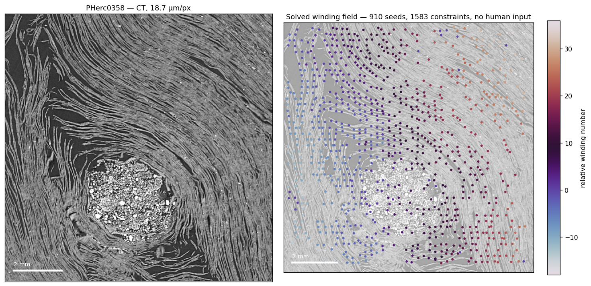

# winding-sync

**Relative winding constraints for scroll unrolling: generated automatically
from CT, reconciled by L1 synchronization, no human in the loop. Relative
structure validated; absolute winding counts not yet calibrated — see
limitations.**

A tool for the [winding constraints problem](https://scrollprize.org/open_problems/winding_annotations)
in the [Vesuvius Challenge](https://scrollprize.org) — the effort to read the
carbonized Herculaneum scrolls without opening them.



*Left: a CT cross-section of PHerc0358, a 2027 Grand Prize scroll. Right: the
winding field this tool recovers from it — 910 seeds and 1,583 constraints,
generated and reconciled with no human input. Colour is relative winding
number. Scale bar 2 mm.*

---

## The problem

To unroll a scroll digitally, the surface fitter needs to know, for pairs of
nearby points in the CT volume, how many windings apart they sit. These
relative winding constraints anchor the whole reconstruction: they are what
stops the fitted surface from drifting onto a neighbouring wrap and rendering
convincing text from the wrong part of the scroll.

Today those constraints are drawn by hand, and contradictions between them are
resolved by hand. The current tooling [7] propagates winding numbers along a BFS
spanning tree and uses the remaining measurements only to *detect* inconsistent
loops — each of which becomes human work to adjudicate. Two structural problems
follow:

1. **A spanning tree is maximally fragile.** One wrong edge high in the tree
   corrupts its entire subtree, unrecoverably, because a tree has no redundancy
   by construction.
2. **The redundant measurements that could *repair* errors are used only to
   raise alarms.** Every detected contradiction costs annotator time.

This tool replaces both halves: constraints are generated automatically from
the volume, and contradictions are resolved globally instead of reported.

---

## The method

### Solving: L1 synchronization over the integers

Assigning integer winding numbers `w` from noisy pairwise measurements
`d_ij ≈ w_i − w_j` is **synchronization over ℤ** — the integer sibling of phase
unwrapping. We minimise total weighted disagreement in L1:

```
minimise   Σ_ij  c_ij · | (w_i − w_j) − d_ij |
```

Three properties make this the right objective rather than a heuristic:

- **The optimization is exact — which is a claim about the solver, not about
  correctness.** Written as a linear program, the constraint matrix is the
  graph's node-arc incidence matrix bordered by identity blocks. Incidence
  matrices are **totally unimodular**, and TU survives appending identity
  columns — so every vertex of the LP polytope is integral whenever the
  measurements are, and a simplex-type solver returns the true integer optimum
  with no rounding and no branch-and-bound (verified empirically: zero deviation
  from integrality on both synthetic graphs and the real PHerc0358 graph with
  non-integer confidence weights). This is Costantini's structure from
  minimum-cost-flow phase unwrapping [3]; the integrality property is
  Hoffman–Kruskal [4]. The framing as group synchronization follows [5].

  To be precise about what this buys: it guarantees the solver finds the best
  possible explanation *of the measurements it is given*. If the measurements
  are wrong — and ours are uncalibrated in absolute count — the solver finds the
  exact optimum of a flawed problem. Exactness removes the solver as a source of
  error; it does not bless the inputs. The results below should be read with
  that separation in mind: the *solving* is provably optimal, the *generating*
  is directionally right and honestly imperfect.
- **Robust to the failure that actually happens.** A wrong constraint is wrong
  by a *whole winding*, not by a little. Least squares squares that error and
  distorts the rest of the solution to reduce it; L1 pays it once and leaves
  the graph alone.
- **Every edge counts.** No spanning tree, so no privileged edges whose failure
  is unrecoverable. Redundant measurements become error-*correcting* rather
  than error-*detecting*.

The scroll's spiral geometry needs no special handling: winding number is an
unbounded integer, not a phase modulo 2π, so circulation around the umbilicus
emerges from the measurements themselves. This is strictly easier than
classical phase unwrapping.

### Generating: probes across the local lamina orientation

The constraints themselves come from the volume, with no human input. A
structure tensor gives the local orientation of the papyrus laminae at every
point — with no assumption of a spiral, an umbilicus, or a global winding
spacing, because real scrolls violate all three (one Grand Prize scroll
measures a circularity ratio of 2.20, and local lamina spacing varies fourfold
across a single 11 mm crop). Short probes cast perpendicular to that
orientation count the laminae they cross; each count is one signed constraint.
Seeds are snapped onto laminae, probes attach to the nearest seed, and large
slices are tiled automatically with overlap so boundary constraints still form.

Individual probes are allowed to be wrong. That is the design: cheap,
plentiful, partly-wrong measurements are exactly what the L1 solver is built to
reconcile, and exactly what tree propagation cannot survive.

---

## Measured results

### Against the current approach

Accuracy of recovered winding numbers vs injected gross-error rate
(7 seeds, sparse graph, 1.9 edges/node):

| gross errors | BFS tree (current) | L2 | **L1 (this tool)** |
|---|---|---|---|
| 0% | 1.000 | 1.000 | **1.000** |
| 5% | 0.500 | 0.853 | **0.994** |
| 10% | 0.454 | 0.812 | **0.973** |
| 15% | 0.373 | 0.780 | **0.939** |
| 20% | 0.287 | 0.745 | **0.867** |

First drop below 95% accuracy: **BFS at 2%, L2 at 5%, L1 at 15%.**

### Redundancy becomes error-correcting

A spanning tree consumes only n−1 edges however many exist, so extra
measurements are nearly wasted on it. Under L1 they repair errors. At a fixed
10% gross-error rate:

| edges/node | BFS tree | **L1** |
|---|---|---|
| 1.91 | 0.454 | 0.973 |
| 3.70 | 0.528 | **1.000** |
| 6.08 | 0.620 | **1.000** |

Redundancy eliminates **98% of L1's residual error** and 30% of the tree's —
which still leaves the tree unusable. The practical instruction inverts: stop
trying to make each measurement perfectly reliable, and collect many more,
tolerating that a minority are wrong. That is exactly what an automatic
detector produces.

### On real carbonized papyrus

> **Note on an earlier claim.** Development notes reported BFS scoring 0.047
> exact agreement against L1's 0.827 on this crop. Those figures predate two
> changes to the constraint generator (along-lamina edges and ridge-snapped
> seeds) and **no longer hold**. On the current generator the same crop gives
> L1 0.703 and BFS 0.629 — a far smaller gap on that metric. Mean absolute
> residual separates them better (0.51 vs 1.75), and on full cross-sections BFS
> collapses entirely, returning a winding range of 0 where L1 returns a
> coherent field. The synthetic breakdown curves above are unaffected: they use
> controlled error injection independent of the generator.

On a full cross-section of PHerc0358 (a 2027 Grand Prize scroll), generation
plus solving with **zero human input**: ~20,000 seeds, ~35,000 constraints,
**97% of seeds in one connected component**, solved in seconds on a laptop.
The same runs on PHerc. Paris 4 produce an internally consistent winding field
whose relative structure is sound; its **absolute count is not validated
against any published figure** — see the calibration note below.

### A measured constant, free to whoever needs it

Winding spacing across **all 13 Grand Prize scrolls**: **207–259 µm, median
225 µm, CV 0.064** — two scanners, two resolutions, thirteen scrolls agreeing.
This sets probe lengths, window sizes and sanity bounds for anyone working on
these volumes, and to our knowledge has not been published.

---

## What does not work yet — read before building on this

Stated here so nobody has to discover it.

- **Absolute winding counts are not calibrated.** The lamina counter is
  resolution-dependent: on PHerc. Paris 4, recovered counts went
  **128 → 184 → 61 → 145** across three attempted fixes at
  different resolutions. Each fix was one parameter tuned against one number,
  so we stopped rather than tune a fourth. The *relative* structure of the
  winding field is sound; the absolute count is not. The proper fix is
  per-location ground truth from the published Paris 4 segment meshes — a
  many-point comparison that makes overfitting visible, which a single scalar
  never can. That is the next step, and help is welcome.
- **Per-constraint agreement plateaus near 0.66** on real scrolls — the same
  value on three scrolls of very different quality, including one already
  successfully read. The ceiling is in the constraint generator, not the
  specimens, and not the solver.
- **A trap, documented so you avoid it:** during calibration, over-smoothing
  cut the recovered count to less than half of truth — while per-constraint
  agreement rose to its best-ever 0.863. The surviving constraints were few,
  clean, and systematically wrong. **Internal consistency is not correctness.
  Do not optimise self-consistency.**
- Synthetic benchmarks use regular grids; real patch graphs have clusters and
  bridges, and a bridge whose measurements are all wrong is unrecoverable
  regardless of the global error rate.

---

## Install and run

```bash
pip install -r requirements.txt

# validate against ground truth we control
python -m winding_sync.validate

# generate + solve on a real scroll, streaming from the open-data bucket
python run_winding_test.py --scroll PHerc0358
```

Windows users: create an isolated environment with
`python -m venv .venv` then `.\\.venv\\Scripts\\python.exe -m pip install -r requirements.txt`.

## Integration

- **Input:** OME-Zarr over `s3://`, `https://`, or local paths. zarr 2.x and
  3.x; Python 3.10–3.14; Windows/macOS/Linux. Streaming throughout — no full
  volume is ever loaded, and large slices tile automatically.
- **Output:** a `WindingGraph` (nodes, edges, integer deltas, confidence
  weights) that drops into any solver, plus the optimal L1 solution for those measurements.
- **The solver is usable standalone** with constraints from any source,
  including existing hand annotations — it can replace the reconciliation step
  of the current workflow without adopting anything else here.
- Automated tests covering exactness, robustness, redundancy and documented
  limits, plus regressions pinned on real carbonized papyrus. Seeds fixed.


---

## Relationship to prior work

This tool does not exist in a vacuum, and the debts should be explicit.

**Henderson's diffeomorphic spiral fitting** [2] is the state-of-the-art
top-down unroller, and its §4 contains the closest prior approach to this work.
It casts rays along local surface normals, builds a graph over surface paths,
then — in its own words — *drops nodes that are part of cycles (since these
imply a contradiction)* and uses *majority voting by edges*. Its Limitations
section names the consequence directly: when paths are contradictory, *the
surface sometimes wanders between two true windings, instead of committing to
one*.

That is the precise gap this tool addresses. A contradictory cycle is not noise
to be discarded — it is a measurement that some nearby constraint is wrong, and
L1 synchronization uses it to locate and repair the error rather than deleting
the evidence. Henderson himself suggests robust alternatives (an L^p norm with
p<1, or an augmented Lagrangian) as future work; L1 over ℤ is a related move
made at the constraint-reconciliation stage rather than inside the surface fit. What this tool adds on
the *generation* side is a route that needs no surface-prediction network —
constraints come straight from the CT via the orientation tensor. What it adds
on the *reconciliation* side is the L1 synchronization formulation with its
integrality property [4], measured against the BFS spanning-tree reconciliation
in the villa production scripts [7]. The L1 objective for this problem class is
Costantini's [3], transplanted from InSAR phase unwrapping to winding numbers —
where it applies *more* cleanly, since winding number is an unbounded integer
rather than a phase modulo 2π.

## References

Verified against primary or citing sources at time of writing. Works are listed
only where this project actually stands on them; nothing is cited for
appearance.

**Foundational — virtual unwrapping**

[1] W. B. Seales, C. S. Parker, M. Segal, E. Tov, P. Shor, Y. Porath. "From
damage to discovery via virtual unwrapping: Reading the scroll from En-Gedi."
*Science Advances* 2(9):e1601247, 2016. doi:10.1126/sciadv.1601247 — the
pipeline this whole field descends from: segment, flatten, texture, read.

[2] P. Henderson. "Virtually Unrolling the Herculaneum Papyri by Diffeomorphic
Spiral Fitting." *WACV 2026*, pp. 6401–6411. arXiv:2512.04927. Code:
https://github.com/pmh47/spiral-fitting — current state of the art, prior work on extracting
relative winding numbers (from neural surface predictions; this tool instead
works directly from CT).

**The optimization**

[3] M. Costantini. "A novel phase unwrapping method based on network
programming." *IEEE Transactions on Geoscience and Remote Sensing*
36(3):813–821, 1998. doi:10.1109/36.673674 — the L1/network-flow objective
transplanted here from InSAR phase to winding number.

[4] A. J. Hoffman, J. B. Kruskal. "Integral Boundary Points of Convex
Polyhedra." In *Linear Inequalities and Related Systems*, Annals of Mathematics
Studies 38, pp. 223–246. Princeton University Press, 1956.
doi:10.1515/9781400881987-014 — total unimodularity implies integral vertices;
the theorem the solver's integrality rests on.

[5] A. Singer. "Angular synchronization by eigenvectors and semidefinite
programming." *Applied and Computational Harmonic Analysis* 30(1):20–36, 2011.
doi:10.1016/j.acha.2010.02.001 — the group-synchronization framing. Note the
difference exploited here: angular synchronization recovers phases modulo 2π,
whereas winding number is an unbounded integer, so no modular ambiguity arises
and the linear-programming route is available.

**The orientation field**

[6] J. Bigün, G. H. Granlund. "Optimal orientation detection of linear
symmetry." *Proceedings of the First International Conference on Computer
Vision (ICCV)*, London, pp. 433–438. IEEE Computer Society, 1987 — the
structure tensor, used here to obtain local lamina orientation without
assuming a spiral or an umbilicus.

**Drawn from [2]'s bibliography — context this work sits in**

[10] S. Parsons, C. S. Parker, C. Chapman, M. Hayashida, W. B. Seales.
"EduceLab-Scrolls: Verifiable Recovery of Text from Herculaneum Papyri using
X-ray CT." arXiv:2304.02084, 2023 — the scan corpus; source of the PHerc. Paris 4
and PHerc. 172 volumes.

[11] J. Schilliger. *ThaumatoAnakalyptor*.
https://github.com/schillij95/ThaumatoAnakalyptor — the other fully-automated
unroller for this data; uses heuristics to decide whether nearby instances lie
on the same winding.

[12] D. Eberly, R. Gardner, B. Morse, S. Pizer, C. Scharlach. "Ridges for image
analysis." *Journal of Mathematical Imaging and Vision* 4:353–373, 1994 — ridge
extraction; the basis for snapping seeds onto laminae here.

[13] C. Steger. "An unbiased detector of curvilinear structures." *IEEE TPAMI*
20(2):113–125, 1998 — curvilinear structure detection, the classical
alternative to the structure-tensor route used here.

[14] F. Nicolardi, S. Parsons, D. Delattre, et al. "Revealing Text from a
Still-Rolled Herculaneum Papyrus Scroll (PHerc. Paris. 4)." *Zeitschrift für
Papyrologie und Epigraphik* 229:1–13, 2024 — the text recovered from the
PHerc. Paris 4 region used here for validation.

[15] C. S. Parker, K. Gessel, S. Parsons, et al. *Volume Cartographer*, 2025.
doi:10.5281/zenodo.14878458 — VC3D; the ground-truth mesh for PHerc. Paris 4
was produced with hundreds of hours of manual annotation using this lineage of
tools, which is the cost this project aims to reduce.

**Data and tooling**

[7] Vesuvius Challenge / EduceLab, *villa* repository (volume-cartographer),
including `scripts/spiral/find_inconsistent_windings.py` — the BFS
winding-consistency baseline measured against here.
https://github.com/ScrollPrize/villa

[8] Vesuvius Challenge, "Winding Constraints" (Open Problem).
https://scrollprize.org/open_problems/winding_annotations

[9] Vesuvius Challenge open data: CT volumes of the 13 Grand Prize scrolls and
PHerc. Paris 4, served as OME-Zarr from
`s3://vesuvius-challenge-open-data`. https://scrollprize.org/data

```bibtex
@inproceedings{henderson26wacv,
  title     = {Virtually Unrolling the Herculaneum Papyri by Diffeomorphic Spiral Fitting},
  author    = {Paul Henderson},
  booktitle = {Proceedings of the IEEE/CVF Winter Conference on Applications of Computer Vision (WACV)},
  pages     = {6401--6411},
  year      = {2026}
}
```

## License

MIT.
